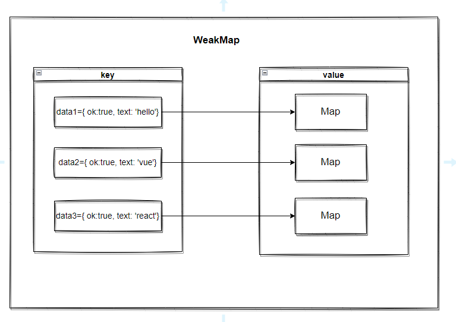
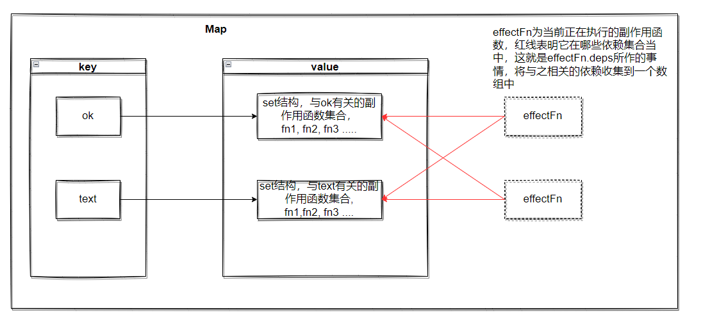

# vue3 响应式系统原理-清除副作用函数

::: tip
本篇文章为阅读《Vue.js 设计与实现》一书第四章《响应系统的作用实现》后所做的笔记
:::

## 响应式数据结构

在 vue3 中，整个响应式数据结构如下图所示：




下面，详细介绍如何清除遗留的副作用函数这一部分：

```js
const data = { ok: true, text: 'hello, vue'}
// 具体的 get 拦截和 set 拦截可查看书中的代码
const obj = new Proxy(data, {/*... */})

effect(function effectFn() {
  document.body.innerText = obj.ok ? obj.text : 'not'
})

obj.ok = false
```

这一段代码的意思是：

ok 为 true 时，页面上内容为 hello, vue

当我们将 ok 的值修改为 false 后，页面上的值为 'not'。

理想情况下，无论如何修改text的值，其对应的副作用函数（text对应的是一个副作用函数依赖集合，这里简单描述为副作用函数 effectFn）都不会再执行。

可事实上，其副作用函数仍然会执行。这就是副作用函数遗留所产生的问题

## 解决方法

这个问题的解决方法就是：**每次在副作用函数执行之前，先将该副作用函数从所有与之关联的依赖集合中删除**

书中有详细描述，可查看对应章节

我想说的是，这里的从依赖集合中清除副作用函数，**并不是将该依赖集合中的所有副作用函数全部删除，而是只删除当前的副作用函数**，这是我在看书时最疑惑的部分

从上图中可以看出，键值（例如，obj.text）对应的是一个set结构，其中包含有很多个副作用函数，真正要清除的是相关依赖集合中的当前副作用函数

```js{7}
const effect = (fn, options = {}) => {
  const effectFn = () => {
    cleanup(effectFn)
    ...
  }
  ...
  // 为副作用函数添加deps属性，用来存储与其相关的副作用函数依赖集合，其实就是图中的set结构
  effectFn.deps = []
  effectFn()
}
```
s
```js{18}
// 依赖收集
function track(target, key) {
  if (!activeEffect) return target[key]
  // 从bucket中取出该对象对应的字段函数依赖
  let depsMap = bucket.get(target)
  if (!depsMap) {
    bucket.set(target, depsMap = new Map())
  }
  // 根据对应的字段，取出对应的副作用函数集合
  let deps = depsMap.get(key)
  if (!deps) {
    depsMap.set(key, deps = new Set())
  }
  // 当读取obj的属性时，会先将副作用函数添加到bucket中
  deps.add(activeEffect)
  // activeEffect.deps 是当前副作用函数的依赖集合数组
  // 数组中的每一项是一个集合，该集合就是与key相关的副作用函数
  activeEffect.deps.push(deps)
}
```

再通过 cleanup 函数清除依赖集合中的当前的副作用函数，就可以解决遗留副作用函数的问题了

```js
// 清除依赖集合中的副作用函数
function cleanup(effectFn) {
  for (let i = 0; i < effectFn.deps.length; i++) {
    const deps = effectFn.deps[i]
    deps.delete(effectFn)
  }
  effectFn.deps.length = 0
}
```

### 例子解析

再回到我们所举的例子中,详细描述一下整个过程
```js
const data = { ok: true, text: 'hello, vue'}
// 具体的 get 拦截和 set 拦截可查看书中的代码
const obj = new Proxy(data, {/*... */})

effect(function effectFn() {
  document.body.innerText = obj.ok ? obj.text : 'not'
})

obj.ok = false
```

1. 副作用函数执行，读取 `obj.ok` 的值，触发对应的 `get` 拦截函数，`effectFn` 被收集到 ok 对应的 `set` 依赖集合中，同时，`effectFn.deps` 也将 ok 对应的set依赖集合(okSet)添加进去
2. 读取 `obj.text` 的值，触发对应的 get 函数，`effectFn` 被收集到 `text` 对应的 `set` 依赖集合中，同时，`effectFn.deps` 也将 text 对应的set依赖集合(textSet)添加进去。此时，`effectFn.deps = [okSet, textSet]`
3. 将 ok 设置为 `false`，触发对应的 set 拦截函数，执行 effectFn 副作用函数
  1. 首先，先清除依赖。遍历 `effectFn.deps`, 将 `effectFn` 从 `okSet` 和 `textSet` 中删除（这是解决副作用函数遗留关键的一步）
  2. 其次，读取 `ok` 的值，将 `effectFn` 添加到 `okSet` 中。由于 ok 的值 为 false，所以，不会读取 `obj.text`，就不会将 `effectFn` 添加到 `textSet` 中
4. 因此，无论如何修改 text 的值，`effectFn` 都不会被触发